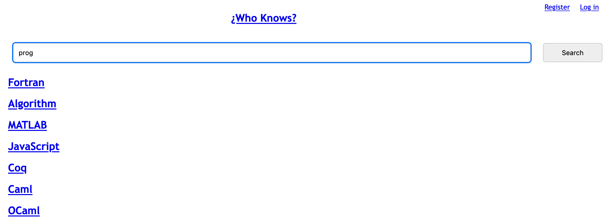

<div class="title-card" style="color: cyan;">
    <h1>The legacy project</h1>
</div>

---

# This is how it all started

A group of students tried to develop a search engine in 2009 with the latest technology at its time. 

They called it: `¿Who Knows?`. 


---

# What they managed to create

 - a backend

 - a frontend

 - an SQLite database (containing scraped Wikipedia articles about programming)

---

# Website screenshot




---

# But it was abandoned

After they presented their main thesis in January 2010, the project was abandoned.

The stack is outdated and the code is not maintained.

The code is in many ways flawed. 

The database contains outdated content from that date or prior. 

Your group will inherit their legacy code. But it's too much to rewrite it in one go. We need CI/CD pipelines to help us rewrite in increments. 

---

# It will be your job to:

  - Analyze the code for flaws

  - Modernize the stack

  - Update the database content


But as a starting point, we need to get the code. 

---

<div class="title-card">
    <h1><a href="https://en.wikipedia.org/wiki/Software_archaeology">Source code archeology</a></h1>
</div>

---

# The only thing we managed to dig up

 - An IP address. 

 - Username

 - Password

Question: *Now what?*

---

# SSH

```bash
ssh <username>@<ip_address>
```

Username: `monkgroup`

Password: `blackmonktime!`

<!-- todo -->
IP address: `68.221.178.95`

---

# How do we check if anything is running and on what port?

There are multiple ways to do it. 

*Can you think of one?*

---

# Nmap

Usually, `nmap` is used for port scanning other servers but we can use it locally. 

Let's see if we can run it:

```bash
$ sudo nmap
```

`Command not found`. Maybe it isn't installed or we don't have the correct permissions. 

`nmap` *could* be a good start but it's possible that something is running on the server that isn't exposed to the network.

---

# **P**rocess **s**tatus with `ps`

List all processes:

```bash
$ sudo ps aux
```

Too much output. Let's filter with `grep` (Global Regular Expression Print):

```bash
$ sudo ps aux | grep "whoknows"
```

Maybe not so useful but we can see that it runs with `python2`.


---

# **l**i**s**t **o**pen **f**iles with `lsof`

The `-i` flag specifies network files. 

```bash
$ sudo lsof -i
```

The port is listed as: `*:http-alt`

<details> 
  <summary>Question: What port is that?</summary>
    Port 8080
</details>

Or use the **n**etwork **P**orts flag (`-nP`) to see the port number. 

```bash
$ sudo lsof -i -nP
```

*How do I check out the website in my browser.*

---

# Doing it again with `netstat`

```bash
$ sudo netstat -tuln
```

`t`: TCP

`u`: UDP

`l`: listening to ports

`n`: numeric output (no DNS lookup)


---

# Where is the code?

---

# We found some code

How do we get it locally?

---

# Secure copy

From your **local machine** (not ssh'd), run this command:

```bash
$ scp -r <username>@<ip_address>:/path/to/directory /path/to/destination
```

The `-r` flag is required because we are retrieving a directory. Without `-r`, it will fail with:

```bash
scp: download /path/to/directory/: not a regular file
```

Replace `/path/to/directory` with `/home/`. Try to figure out the rest. 

**DO NOT** run this while ssh'd into the server!


